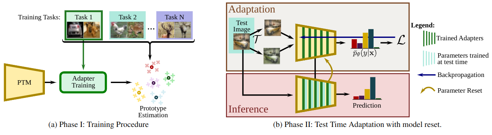

# Rethinking Class-incremental Learning in the Era of Large Pre-trained Models via Test-Time Adaptation

<div align="center">

<div>
    <a href='' target='_blank'>Imad Eddine MAROUF</a><sup>1</sup>&emsp;
    <a href='' target='_blank'>Subhankar Roy</a><sup>2</sup>&emsp;
    <a href='' target='_blank'>Enzo Tartaglione</a><sup>1</sup>&emsp;
    <a href='' target='_blank'>Stéphane Lathuilière </a><sup>1</sup>
</div>
<div>
<sup>1</sup>Telecom-Paris, Institut Polytechnique de Paris&emsp;

<sup>2</sup>University of Aberdeen&emsp;
</div>
</div>


The code repository for "[Rethinking Class-incremental Learning in the Era of Large Pre-trained Models via Test-Time Adaptation](https://arxiv.org/abs/2310.11482)" in PyTorch.


## Abstract

Class-incremental learning (CIL) is a challenging task that involves continually learning to categorize classes into new tasks without forgetting previously learned information. The advent of the large pre-trained models (PTMs) has fast-tracked the progress in CIL due to the highly transferable PTM representations, where tuning a small set of parameters results in state-of-the-art performance when compared with the traditional CIL methods that are trained from scratch. However, repeated fine-tuning on each task destroys the rich representations of the PTMs and further leads to forgetting previous tasks.

To strike a balance between the stability and plasticity of PTMs for CIL, we propose a novel perspective of eliminating training on every new task and instead performing test-time adaptation (TTA) directly on the test instances. Concretely, we propose **Test-Time Adaptation for Class-Incremental Learning (TTACIL)** that first fine-tunes Layer Norm parameters of the PTM on each test instance for learning task-specific features, and then resets them back to the base model to preserve stability. As a consequence, our TTACIL does not undergo any forgetting, while benefiting each task with the rich PTM features. Additionally, by design, our TTACIL is robust to common data corruptions. Our TTACIL outperforms several state-of-the-art CIL methods when evaluated on multiple CIL benchmarks under both clean and corrupted data.



## Requirements
### Environment
install the conda environment using the provided yml file.

## Running scripts
Please follow the settings in the `exps` folder to prepare your json files, and then run:

```
python main.py --config ./exps/adapt_tta.json
```

## Citation

If you find this work helpful, please cite our paper.

```bibtex
@misc{marouf2023rethinking,
      title={Rethinking Class-incremental Learning in the Era of Large Pre-trained Models via Test-Time Adaptation}, 
      author={Imad Eddine Marouf and Subhankar Roy and Enzo Tartaglione and Stéphane Lathuilière},
      year={2023},
      eprint={2310.11482},
      archivePrefix={arXiv},
      primaryClass={cs.CV}
}
